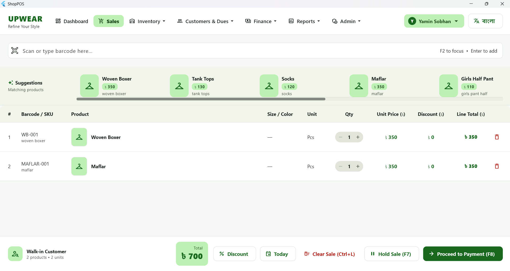
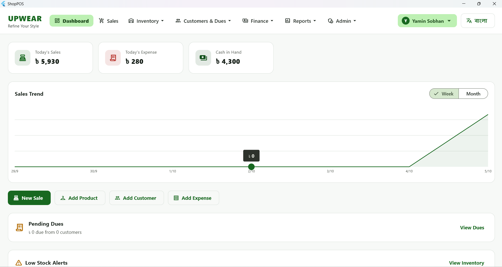
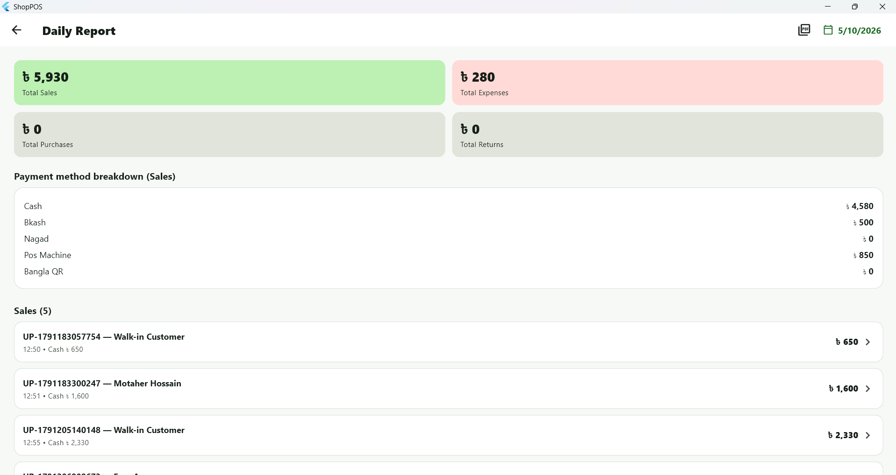
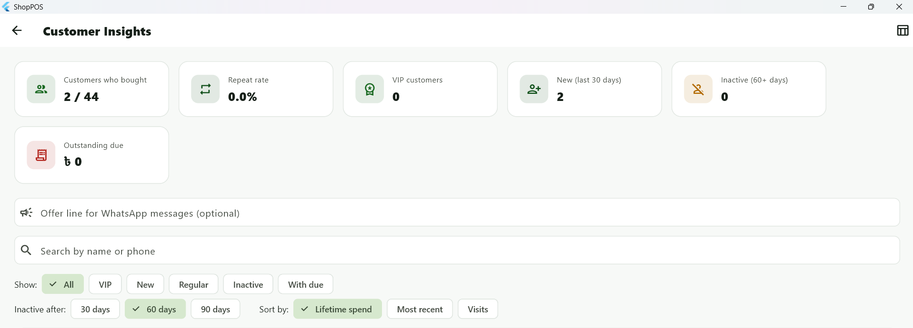
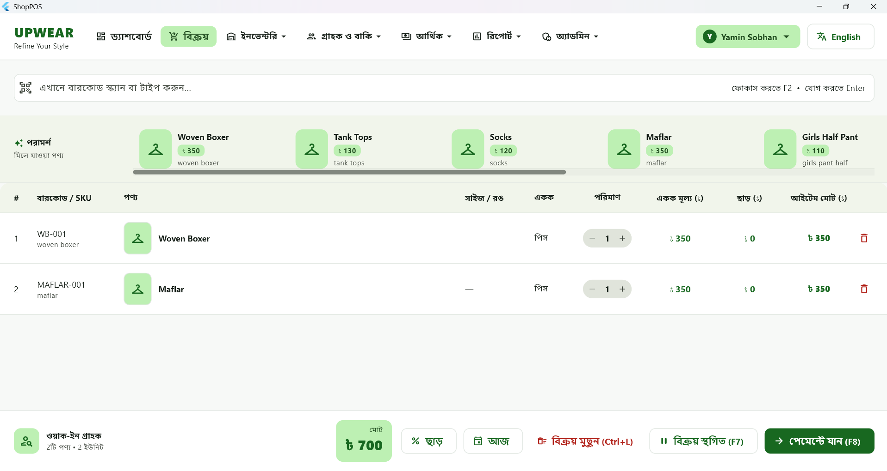

# ShopPOS — Offline Point-of-Sale & Inventory Software for Retail Shops

A Windows desktop POS, inventory and shop-accounting system built with **Flutter**. It is designed for small retail shops in Bangladesh: it works **100% offline**, switches between **English and Bangla** with one click, and keeps sales, stock, customer dues, expenses and bank balances in one place.

> **Status:** running with live data in my own clothing store; preparing the first external pilots.
> **Source:** ShopPOS is a commercial product, so the source code is private. This repository is a showcase of the product and the engineering behind it.



| | |
|---|---|
|  |  |
|  |  |

---

## The problem

Small shops usually run on a paper notebook or a basic billing tool. Stock numbers drift, customer dues get forgotten, the day's cash never quite matches, and one dead hard drive can erase years of records. Cloud POS systems solve some of this but need a reliable internet connection and a monthly fee, and few of them speak Bangla.

I run a clothing shop myself, so I started by building the tool I wished I had: fast at the counter, honest about the numbers, and safe against data loss.

## The solution

ShopPOS is a native Windows app with a local database. Nothing depends on the internet, a barcode scanner works out of the box, and every screen can be switched to Bangla at runtime.

## What it does

**At the counter**
- Barcode/SKU scanning plus a live, ranked search by SKU, barcode, name, size or colour
- Held sales, line and order discounts, VAT, price override, keyboard shortcuts (F2 / F7 / F8 / Ctrl+L)
- Split payments across Cash, bKash, Nagad, POS machine and Bangla QR
- Invoice and gift-memo PDFs, sales history, returns with cash refund or due adjustment

**Stock & purchasing**
- Products with size/colour variants, stock in/out history, low-stock alerts
- Supplier purchases with payments and supplier dues
- Barcode label printing (PDF) and bulk CSV import for products and customers
- Reorder planner: suggests what to buy from recent selling speed and sends the order to the supplier on WhatsApp

**Customers & money**
- Customer dues with WhatsApp reminders, old-due entry, payment collection
- Customer insights: VIP / regular / new / inactive segments, repeat rate, lifetime spend
- Expenses by category, bank and mobile-banking accounts with deposits, withdrawals and transfers
- Staff accounts with PIN login, salary ledger and an activity log

**Reports**
- Daily report with cash closing (opening cash, cash sales, due collections, expenses, purchases, refunds, take-home and bank deposit)
- Monthly, yearly and custom-range income statements
- Product performance (margin, dead stock) and staff performance (sales, discounts, returns)
- PDF and Excel export on the main screens

---

## Engineering highlights

### Offline, machine-bound licensing
The app has to be sold without a server, so licences are verified entirely on the device.
- **Ed25519 signatures**: the licence key is a signed payload (customer, machine, issue and expiry date). The app only contains the public key.
- **Machine binding**: a hashed Windows MachineGuid gives each PC a short Machine ID that the key is tied to.
- **15-day trial** with tamper detection: the start date is stored redundantly (a file and the registry) and a clock rolled back by more than a day is detected.
- A separate command-line **keygen tool** issues licences and keeps a log. The private key never lives in the app repository.
- No offline scheme is unbreakable; the goal is to stop casual copying without punishing honest customers.

### Backups that can actually be restored
- Snapshots made with SQLite `VACUUM INTO`, verified with `PRAGMA quick_check` and a schema sanity check before they count
- Automatic daily backup with an hourly due-check, the latest 30 are kept
- Optional **second backup location** (USB drive or a cloud-synced folder), and a red in-app banner when backups are overdue or the drive is missing
- Restore from any backup file, with an automatic safety backup taken just before the restore

### Bangla and English, switched at runtime
- A drop-in translation layer behind a custom `Text` widget: about 800 UI strings translated through a dictionary, plus pattern rules for sentences with numbers and names
- Untranslated text falls back to English, so a missing entry never breaks a screen
- Bundled Noto Sans Bengali font and localised date pickers; the language is remembered between launches

### Data safety by design
- Customer data lives outside the program folder, so updates and reinstalls never touch it
- Versioned SQLite schema with migrations (currently 21 versions), so upgrades keep old data
- First-run setup wizard (shop details, logo, admin PIN) and white-label constants so the product name and defaults are set in one place

### Distribution
- Release build packaged with an **Inno Setup** installer that also installs the Microsoft VC++ runtime when a PC is missing it

## Architecture

```
lib/
  core/            database, models, repositories, licensing, backup, i18n, widgets
  features/        sales, products, inventory, purchases, returns, customers, dues,
                   expenses, bank, staff, reports, settings, setup, license ...
```

- **Feature-first structure**, each feature owns its screens and widgets
- **Repository pattern**: repositories are created once at startup and passed down through constructors
- **Local-first**: SQLite through `sqflite_common_ffi`, no network calls in the core flows

## Tech stack

Flutter (Windows desktop) · Dart · Material 3 · SQLite (`sqflite_common_ffi`) · `cryptography` (Ed25519) · PDF/printing · Excel export · Inno Setup

## Challenges and what I learned

- **Designing licensing without a server** meant thinking like an attacker for a while: where state can be stored, what a user can delete, how clocks can be moved.
- **Backups are only useful if you test the restore.** That led to verification, a second location and a stale-backup warning instead of a simple "copy the file" button.
- **Translating a whole app late in the project** was solved with a translation layer instead of rewriting hundreds of widgets.
- **POS ergonomics** matter: scanner speed, keyboard flow, and never adding the wrong product on a misread barcode.

## Roadmap

- Automated test coverage for pricing, stock and cash-closing logic
- Code-signed installer and in-app updates
- Bangla PDFs and receipt printer support
- Optional cloud backup

---

## Work with me

I build Flutter apps and WooCommerce/WordPress solutions for small businesses.

- Portfolio: https://yaminsobhan.com
- Email: hello@yaminsobhan.com
- LinkedIn: https://www.linkedin.com/in/yamin-sobhan
- Fiverr: https://www.fiverr.com/s/aekRl1K
- Upwork: https://www.upwork.com/freelancers/~013d82cdec6fe891f5
